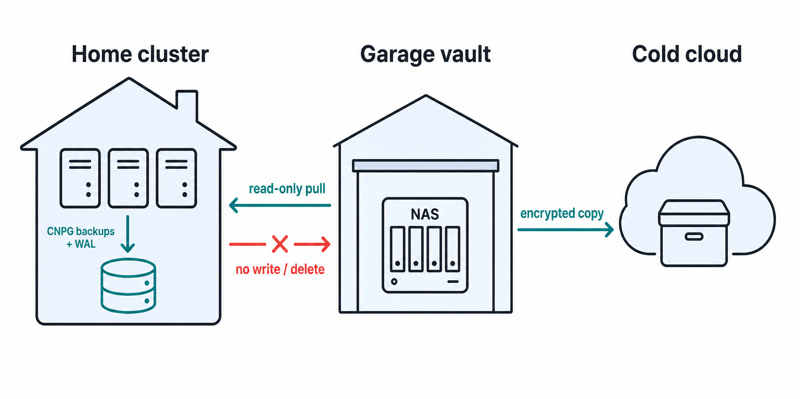

# ADR-0001: Pull-based backup and portable recovery
- Status: Proposed
- Date: 2026-07-23
- Decision owner: Dan Webb



## Context

CloudNativePG database backups and WAL archives are currently written to
per-application buckets in the in-cluster RustFS S3-compatible object store.
The current design protects against an individual database or volume failure,
but it does not independently protect the backup archive from a cluster-wide
compromise or loss of the house.

Cloudflare R2 was previously used for backups, but its ongoing storage cost was
not proportionate to the required recovery posture. A detached garage roughly
35 metres from the house is available for a separate backup appliance, using
spare HDDs. It is a separate building and therefore a strong near-site recovery
location, but it is not a geographically independent recovery site.

The desired outcome is to preserve recoverable data through a cluster,
primary-storage, or house loss without paying for continuously hot cloud
storage. This is **portable recovery**, not hot disaster recovery: if the
property is unavailable, services will be restored to replacement or temporary
compute later.

## Decision

Adopt a pull-based, layered backup design.

```text
CNPG and workload backups -> in-cluster RustFS
Garage vault pulls a read-only copy from RustFS
Garage vault makes a periodic encrypted copy to cold cloud storage
```

The initial implementation priority is CloudNativePG Barman base backups and
WAL archives. Workload volumes, bootstrap material, and recovery documentation
must join the strategy before it is fully implemented.

### Security and ownership boundaries

1. The garage vault initiates every transfer. The home cluster has no
   credentials, route, or administrative interface that can write to or delete
   from the garage repository.
2. The garage uses a RustFS identity limited to listing and reading relevant
   backup buckets. Separate target credentials write the garage repository.
3. Replication is additive: upstream deletes, delete markers, and arbitrary
   overwrites must not remove retained garage history.
4. Retention and garbage collection are controlled by the garage with a
   separate protected credential. The routine copy identity cannot remove
   retained recovery points.
5. The garage repository is encrypted at rest. Encryption-key recovery
   material is stored outside the property and cannot depend on the cluster.
6. The garage exposes no generally reachable management service to the home
   cluster. Required connectivity is initiated by the garage and limited to
   backup traffic.

### Retention and recoverability

The garage vault owns its day-based retention lifecycle, but it must be
Barman/PITR-aware. A base backup cannot expire independently of WAL needed to
recover it. Retention automation must preserve a complete recoverable backup
generation and its required WAL/history files, rather than applying a generic
object-age deletion rule.

Exact local and cloud retention durations are deferred until implementation
measures real archive volume and cold-copy cost. The policy must state the
oldest restore point, PITR window, immutable-history interval, and expected
RPO for every protected data class. Until then, conservative retention is safer
than automated pruning.

### Property-loss recovery

The garage is a near-site backup vault, not an alternate compute site. It can
preserve data after house-local failures, but cannot restore services when the
property is unavailable.

The periodic encrypted cold-cloud copy is the off-property last-resort copy.
It must contain enough data and recovery material to provision temporary or
replacement compute.

Required recovery material includes:

- the GitOps repository and bootstrap instructions;
- encrypted configuration and the means to recover its encryption keys;
- access to the secrets-manager account and its recovery process; and
- a tested procedure to provision fresh compute and restore a CNPG cluster from
  the copied Barman archive.

No continuously running remote cluster is required. The accepted trade-off is
a recovery time measured in days, rather than immediate service continuity,
after loss of the property.

## Consequences

### Positive

- A compromised cluster cannot directly erase garage recovery history.
- The garage provides faster local recovery while being physically separate
  from the house.

- A low-frequency cold-cloud copy protects against property loss without the
  cost of a continuously hot cloud archive.
- Retention becomes a policy of the backup vault, not an accidental effect of
  source-bucket cleanup.

### Negative and accepted trade-offs

- The NAS needs supported software, redundant disks, monitoring, power
  protection, encryption, and maintenance.
- The house and garage share some risks; cold cloud storage remains necessary.
- Pulls delay replication by their schedule and need restricted connectivity.
- This design does not provide immediate compute after property loss.

## Rejected alternatives

### Cluster-pushed backups to the garage

Rejected because a cluster compromise would expose the garage write/delete
credential and make the independent copy vulnerable to the same incident.

### Destructive mirroring from RustFS

Rejected because source deletion—accidental or malicious—would remove the very
history needed for recovery.

### Cloud-only hot backups

Rejected because the earlier Cloudflare R2 operating cost was not justified by
the required recovery time. Cold cloud storage remains as the smaller,
property-loss copy.

### Garage-only backups

Rejected because a separate building on the same property is not sufficient
protection from total property loss.

### Immediate multi-site/high-availability disaster recovery

Rejected for now because it adds ongoing compute, operational complexity, and
runbook burden beyond the portable-recovery objective.

## Implementation and acceptance criteria

1. Rebuild the old NAS with supported software, encrypted redundant storage,
   disk-health monitoring, and power protection.
2. Create separate RustFS read-only identities for the garage puller and
   separate target/retention identities that do not exist in Kubernetes.
3. Implement additive, integrity-checked copies of CNPG Barman archives to the
   garage, alerting on a missed pull or verification failure.

4. Add PITR-aware garage retention and an immutable-history interval. Prove
   pruning retains a complete restore chain before enabling it.
5. Copy selected garage recovery points, encrypted, to a provider-neutral cold
   cloud target on a costed schedule.
6. Prove a full restore and a Point-in-Time Recovery from the garage copy.
7. Prove a portable restore from the cold-cloud copy to fresh temporary or
   replacement compute, including bootstrap and secrets recovery.

The strategy is operational only when steps 6 and 7 have succeeding evidence
and the tested RPO/RTO are documented.

## Open decisions

- NAS operating system, storage layout, and pull transport.
- Exact local and cold-cloud retention schedules after measuring archive size.
- Cold-storage provider and monthly spending ceiling.
- Encryption-key escrow and secrets-manager recovery procedure.
- Temporary/replacement compute provider or physical destination for a
  property-loss event.

## References

- CloudNativePG Barman Cloud Plugin documentation:
  <https://cloudnative-pg.io/plugin-barman-cloud/docs/>
- CISA ransomware guidance on maintaining separate, segmented, and tested
  backups: <https://www.cisa.gov/stopransomware/ransomware-guide>
