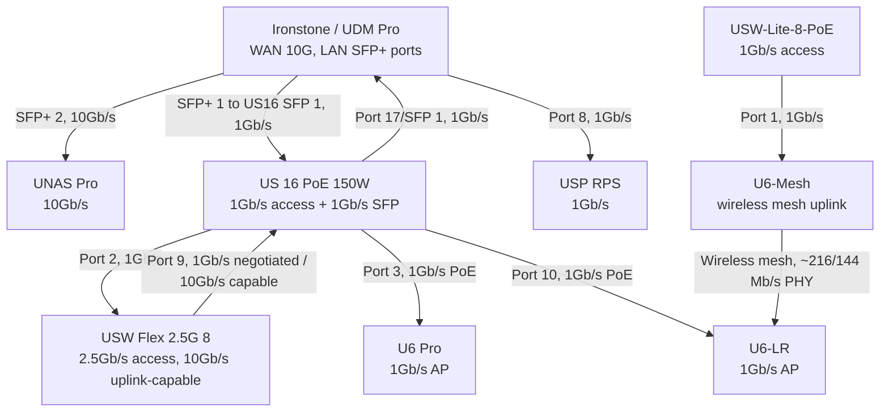
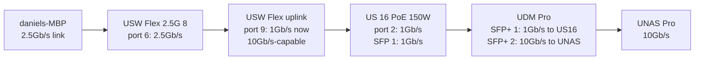

# Network Inventory - 2026-05-18

Source: `unifi-cli` against UniFi controller `Ironstone` v10.3.58, with a scratch raw reader for legacy `/stat/device` and `/stat/sta` because `unifi-cli devices ports` currently fails decoding the port table response.

## Controller Summary

- Controller: `Ironstone`, timezone `Europe/London`, update available: `false`
- WAN: `86.173.119.10`, ISP `BT`
- Networks: `Default` VLAN 1, `Kubernetes` VLAN 2, `IoT` VLAN 3
- Health: `wan`, `www`, `vpn` OK; `wlan` warning; `lan` error
- Inventory: 10 UniFi devices, 49 clients, 3 online APs, 5 LAN switches reported by health

## Topology

## Confirmed Bandwidth Constraints

| Area | Current | Capability | Note |
| --- | ---: | ---: | --- |
| UDM Pro SFP+ 1 to US 16 PoE SFP 1 | 1Gb/s | UDM side 10Gb/s, US16 side 1Gb/s | The DAC is 10G-capable, but the US16 SFP port limits this link to 1Gb/s. |
| USW Flex 2.5G 8 uplink to US 16 PoE port 2 | 1Gb/s | Flex uplink port reports 10Gb/s max | Biggest confirmed upgrade target. The Flex can uplink faster, but it is connected to a 1Gb/s US16 copper port. |
| USW-Lite-8-PoE downstream segment | 1Gb/s switch ports | Upstream is U6-Mesh wireless | Wired clients on this switch traverse a wireless mesh backhaul currently around 216/144 Mb/s PHY. |
| UNAS Pro on UDM Pro SFP+ 2 | 10Gb/s | 10Gb/s | Already using high-speed link. |
| daniels-MBP on USW Flex port 6 | 2.5Gb/s | 2.5Gb/s | Already using the Flex 2.5Gb/s access port. |
| PiKVM on USW Flex port 7 | 1Gb/s | Port supports 2.5Gb/s | Endpoint appears to negotiate 1Gb/s. |
| Yale Home on USW Flex port 8 | 100Mb/s | Port supports 2.5Gb/s | Likely endpoint-limited. |

Candidate endpoint upgrades that UniFi cannot prove from current negotiation: the `node-*` hosts use Realtek OUIs and are on 1Gb/s US16 ports. If their NICs are 2.5GbE, moving them to 2.5GbE access ports or a multigig switch would unlock more bandwidth.

## Critical Path: daniels-MBP to UNAS Pro

`daniels-MBP` is locally connected at 2.5Gb/s, but the path to storage is capped upstream.

| Hop | Current link | Max visible from UniFi | Effect |
| --- | ---: | ---: | --- |
| `daniels-MBP` to USW Flex port 6 | 2.5Gb/s | 2.5Gb/s | Fast enough for 2.5Gb/s storage access. |
| USW Flex uplink port 9 to US 16 PoE port 2 | 1Gb/s | Flex side reports 10Gb/s-capable | First hard bottleneck. |
| US 16 PoE SFP 1 to UDM Pro SFP+ 1 | 1Gb/s | UDM side 10Gb/s, US16 side 1Gb/s | Second hard bottleneck, but the path is already capped at 1Gb/s by the Flex uplink. |
| UDM Pro SFP+ 2 to UNAS Pro | 10Gb/s | 10Gb/s | Not the bottleneck. |

Expected storage throughput from `daniels-MBP` to `UNAS-Pro` today: roughly 940Mb/s TCP line rate, or about 110-118MB/s before SMB/filesystem overhead. A realistic SMB copy may land closer to 100-115MB/s.

If the USW Flex gets a 10Gb/s path to the UDM/UNAS side, `daniels-MBP` becomes the bottleneck instead. Expected practical ceiling then becomes about 2.35Gb/s TCP, or roughly 280-295MB/s before storage/protocol overhead.

The fastest no-new-switch improvement is to move the USW Flex 10Gb/s uplink directly onto the 10Gb/s core path, then hang the US16 off a 1Gb/s downstream path for PoE/legacy devices. That would specifically improve `daniels-MBP` to `UNAS-Pro`, but it would not make the `node-*` hosts faster while they remain on US16 1Gb/s ports.

## Single-Device Upgrade

The best single device to add is a 10Gb/s aggregation/core switch between the UDM Pro, UNAS Pro, USW Flex 2.5G 8, and any future multigig hosts.

Target role:

- UDM Pro SFP+ to aggregation at 10Gb/s
- UNAS Pro to aggregation at 10Gb/s
- USW Flex uplink to aggregation at 10Gb/s
- US16 remains connected for 1Gb/s PoE/AP/IoT duties

This removes both current 1Gb/s aggregation choke points for the Mac-to-storage path and creates somewhere sensible to attach future 2.5GbE/10GbE nodes. If replacing instead of adding, replace the US 16 PoE 150W with a switch that has 10Gb/s uplinks and enough 2.5GbE PoE/access ports; that is the single replacement with the broadest internal-network impact.

## Capability Detection Limits

The first inventory prioritized confirmed facts from UniFi: current negotiated speed, switch port media, port speed capability, and uplink capability. It did not mark every 1Gb/s client as "can do 2.5Gb/s" because UniFi does not reliably expose the endpoint NIC maximum for generic wired clients.

What UniFi can prove here:

- The USW Flex access ports are 2.5Gb/s-capable.
- The USW Flex uplink reports 10Gb/s capability but is only negotiating 1Gb/s.
- `daniels-MBP` is definitely 2.5Gb/s-capable because it is currently linked at 2.5Gb/s.
- The `node-*` clients are on 1Gb/s US16 ports, so their current 1Gb/s link does not prove whether the nodes themselves are 1GbE or 2.5GbE.

What needs host-side validation:

- Confirm each `node-*` NIC capability with `ethtool` or OS inventory.
- Confirm PiKVM and Yale Home endpoint NIC limits before treating their 1Gb/s or 100Mb/s links as fixable.
- Confirm whether the U7 In-Wall should be brought online as a 2.5GbE AP/switch edge; UniFi reports 2.5Gb/s-capable ports, but the device is currently offline.

## UniFi Devices

| Device | Model | IP | State | Uplink |
| --- | --- | --- | --- | --- |
| Ironstone | UDM Pro | `86.173.119.10` | Online | WAN wire, 10Gb/s |
| US 16 PoE 150W | US16P150 | `192.168.1.163` | Online | UDM Pro port 10, 1Gb/s SFP |
| USW Flex 2.5G 8 | USWED36 | `192.168.1.190` | Online | US 16 PoE port 2, 1Gb/s negotiated, 10Gb/s max |
| USW-Lite-8-PoE | USL8LPB | `192.168.1.38` | Online | U6-Mesh Ethernet, then wireless mesh uplink |
| USP RPS | USPRPS | `192.168.1.24` | Online | UDM Pro port 8, 1Gb/s |
| U6-LR | UALR6v2 | `192.168.1.155` | Online | US 16 PoE port 10, 1Gb/s |
| U6 Pro | UAP6MP | `192.168.1.201` | Online | US 16 PoE port 3, 1Gb/s |
| U6-Mesh | U6M | `192.168.1.109` | Online | Wireless mesh to U6-LR |
| U6-Lite | UAL6 | `192.168.1.240` | Offline | Wireless uplink record to U6-LR |
| U7 In-Wall | UAPA6A5 | `192.168.1.211` | Offline | Wireless uplink record to U6-LR; ports report 2.5Gb/s capability |

## Switch Port Map

### Ironstone / UDM Pro

| Port | Link | Attached |
| --- | ---: | --- |
| Port 8 | 1Gb/s | USP RPS |
| Port 9 | 1Gb/s | WAN |
| SFP+ 1 / port 10 | 1Gb/s | US 16 PoE 150W SFP 1, DAC `SFP-H10GB-CU1M` |
| SFP+ 2 / port 11 | 10Gb/s | UNAS Pro, DAC `DAC-SFP10-0.5M` |

### US 16 PoE 150W

| Port | Link | Attached |
| --- | ---: | --- |
| 2 | 1Gb/s | USW Flex 2.5G 8 uplink |
| 3 | 1Gb/s | U6 Pro |
| 5 | 100Mb/s | Aqara-Hub-M3-9F59 |
| 7 | 100Mb/s | `C42996C5F3A6` |
| 10 | 1Gb/s | U6-LR |
| 13 | 1Gb/s | ups-monitor |
| 14 | 1Gb/s | node-0b06a7 |
| 15 | 1Gb/s | node-0b06df |
| 16 | 1Gb/s | node-0b0715 |
| 17 / SFP 1 | 1Gb/s | UDM Pro SFP+ 1 |

### USW Flex 2.5G 8

| Port | Link | Attached |
| --- | ---: | --- |
| 6 | 2.5Gb/s | daniels-MBP |
| 7 | 1Gb/s | pikvm |
| 8 | 100Mb/s | Yale Home |
| 9 | 1Gb/s | Uplink to US 16 PoE port 2; port is 10Gb/s-capable |

### USW-Lite-8-PoE

| Port | Link | Attached |
| --- | ---: | --- |
| 1 | 1Gb/s | U6-Mesh / uplink path |
| 3 | 100Mb/s | BirdCam |
| 4 | 1Gb/s | Garage |
| 5 | 100Mb/s | Outdoor Philips Hue Bridge |

## Wired Clients

| Client | IP | Switch / Port | Current rate |
| --- | --- | --- | ---: |
| UNAS-Pro | `192.168.1.243` | UDM Pro SFP+ 2 | 10Gb/s |
| node-0b06a7 | `192.168.1.233` | US 16 PoE port 14 | 1Gb/s |
| node-0b06df | `192.168.1.220` | US 16 PoE port 15 | 1Gb/s |
| node-0b0715 | `192.168.1.186` | US 16 PoE port 16 | 1Gb/s |
| daniels-MBP | `192.168.1.181` | USW Flex 2.5G 8 port 6 | 2.5Gb/s |
| pikvm | `192.168.1.108` | USW Flex 2.5G 8 port 7 | 1Gb/s |
| Yale Home | `192.168.1.161` | USW Flex 2.5G 8 port 8 | 100Mb/s |
| Garage | `192.168.1.168` | USW-Lite-8-PoE port 4 | 1Gb/s |
| BirdCam | `192.168.1.180` | USW-Lite-8-PoE port 3 | 100Mb/s |
| Outdoor Philips Hue Bridge | `192.168.1.73` | USW-Lite-8-PoE port 5 | 100Mb/s |
| Aqara-Hub-M3-9F59 | `192.168.1.22` | US 16 PoE port 5 | 100Mb/s |
| `C42996C5F3A6` | `192.168.1.214` | US 16 PoE port 7 | 100Mb/s |
| ups-monitor | `192.168.1.101` | US 16 PoE port 13 | 1Gb/s |

## Wireless Summary

| AP | MAC | Clients | Backhaul |
| --- | --- | ---: | --- |
| U6-LR | `24:5a:4c:9a:2c:e9` | 15 | Wired 1Gb/s to US 16 PoE |
| U6 Pro | `9c:05:d6:e7:af:ec` | 19 | Wired 1Gb/s to US 16 PoE |
| U6-Mesh | `ac:8b:a9:d4:89:59` | 2 | Wireless mesh to U6-LR |

Notable low wireless rates at collection time: `Samsung-Dryer` 1Mb/s RX, `Meross Smart Garage` 1Mb/s RX, `shellypluspluguk-048308de49d4` 5Mb/s RX, and `KP115` on U6-Mesh 26Mb/s RX.

## Recommended Upgrade Order

1. Replace or bypass the US 16 PoE as the aggregation point for multigig devices. It is holding both the USW Flex uplink and UDM SFP+ link to 1Gb/s.
2. Give the USW Flex 2.5G 8 a real 10Gb/s or at least 2.5Gb/s uplink, ideally directly to a 10Gb/s-capable switch/router port.
3. Move any confirmed 2.5GbE `node-*` hosts off the US16 1Gb/s ports and onto multigig access.
4. Avoid placing important wired devices behind the USW-Lite-8-PoE while its upstream path is the U6-Mesh wireless backhaul.
5. Investigate the UniFi LAN health error and WLAN warning separately; inventory completed, but the controller reports degraded LAN/WLAN health.
